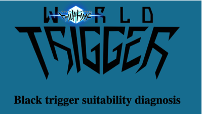
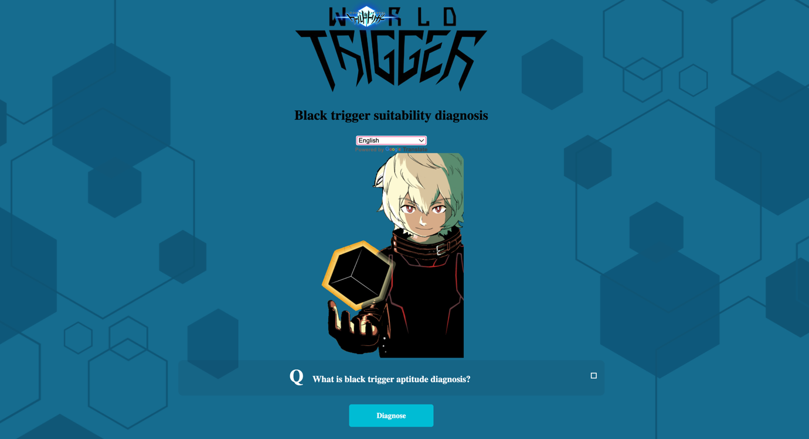

 

  

  

    Which Black Trigger suits you best in World Trigger? Find out your perfect match by answering this diagnostic test!
     
     
    <a href="https://github.com/AtenaHatta/"><strong>Explore the docs »</strong></a>
     
     
    <a href="https://blacktriggerdiagnose.netlify.app/">View Demo</a>
    .
    <a href="https://github.com/AtenaHatta//issues">Report Bug</a>
    .
    <a href="https://github.com/AtenaHatta//issues">Request Feature</a>
  

## Table Of Contents

* [About the Project](#about-the-project)
* [Built With](#built-with)
* [Usage](#usage)
* [Contributing](#contributing)
* [Authors](#authors)

## About The Project

## Built With

* [jQuery]()
* [JavaScript]()
* [HTML5]()
* [CSS3]()

## Usage

Please start by selecting your preferred language. Once you've chosen your language, click on "What is the Black Trigger Compatibility Test?" to read the description. Then, click on the "Start Diagnosis" button and answer the questions. Finally, we will diagnose and determine which Black Trigger suits you best based on your responses.

## Contributing

Contributions are what make the open source community such an amazing place to be learn, inspire, and create. Any contributions you make are **greatly appreciated**.
* If you have suggestions for adding or removing projects, feel free to [open an issue](https://github.com/AtenaHatta//issues/new) to discuss it, or directly create a pull request after you edit the *README.md* file with necessary changes.
* Please make sure you check your spelling and grammar.
* Create individual PR for each suggestion.
* Please also read through the [Code Of Conduct](https://github.com/AtenaHatta//blob/main/CODE_OF_CONDUCT.md) before posting your first idea as well.

### Creating A Pull Request

1. Fork the Project
2. Create your Feature Branch (`git checkout -b feature/AmazingFeature`)
3. Commit your Changes (`git commit -m 'Add some AmazingFeature'`)
4. Push to the Branch (`git push origin feature/AmazingFeature`)
5. Open a Pull Request

## Authors

* **Atena Hatta** - ** - [Atena Hatta](https://github.com/AtenaHatta) - **

